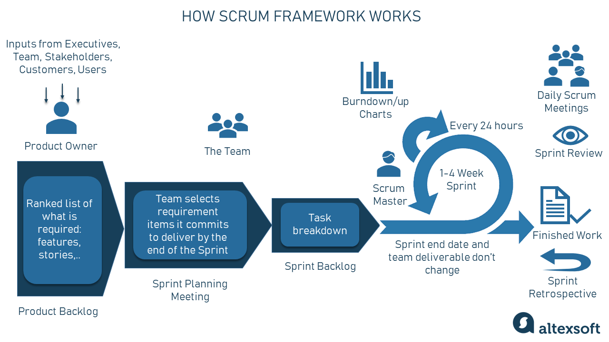
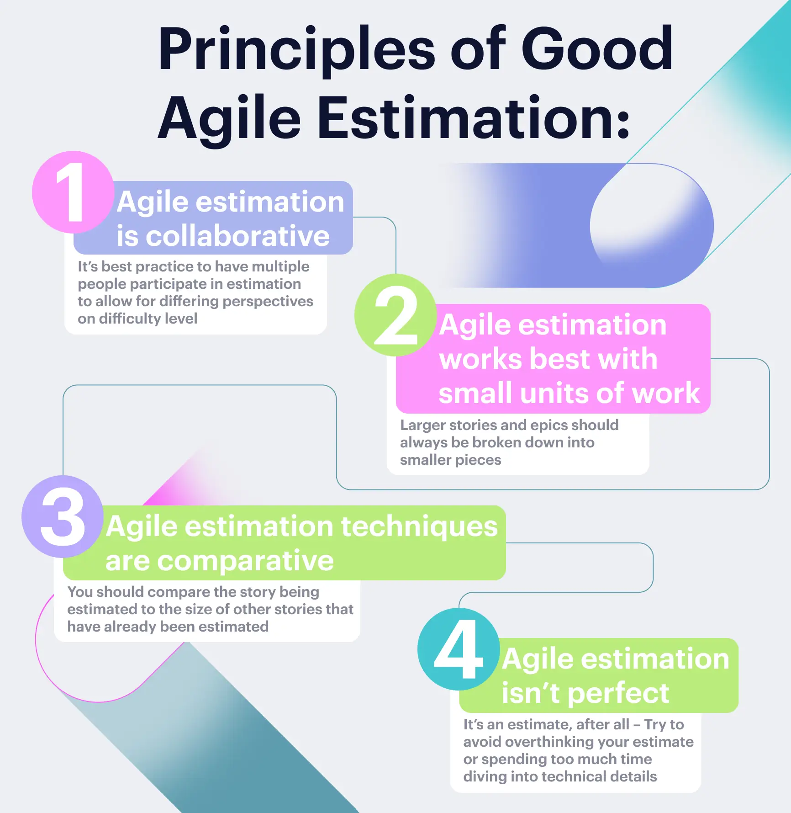
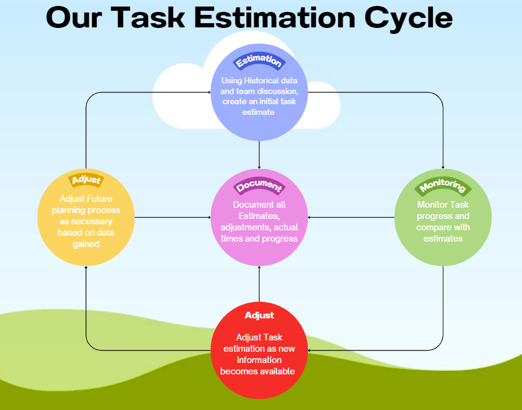
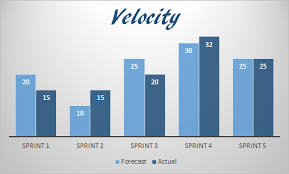

# Quality Assurance Handbook

## Introduction

## Task Estimation in Scrum
  
### Introduction  
- Task estimation is the process a scrum team goes through outlining how long a given task or user story will take to complete. 
    - Teams usually measure using units like story points, ideal days or hours. 

    - There are also various methods for calculating these units, like planning poker and t-shirt sizing, etc, which we will discuss [below.](#estimation-techniques) 
    
    - These methods take all team members' opinions into account to facilitate a more accurate estimation process. 

    - The primary goal of task estimation is to improve the accuracy of sprint planning and facilitate sustainable/predictable project progress.

    - In the below sections, we will outline guidelines and best practices related to the topic of task estimation in scrum while also highlighting what should be avoided in relevant sections.

### Estimation Techniques

- There are many different approaches and techniques to estimating tasks, such as:

	 - Planning Poker: Where team members estimate the effort of a task by playing a number card face down, then discussing all the estimates and coming to an agreement.
	- T-Shirt Sizes: Uses sizes (XS, S, M, L, XL) to estimate the size complexity of tasks.
	 - Fibonacci Story Points: Used to represent the effort required for completing a task using the Fibonacci number sequence 1,2,3,5,8,13.

- Despite the variety of techniques available, there are foundational best practices that all teams should adhere to, regardless of the specific estimation method employed.

	- Estimates should be made by the people carrying out the work not an above hierarchy.
	- Acknowledge human tendencies like optimism bias that can lead to underestimation.
	- Avoid using time-based estimates, as time is a definite measurement, and a definite measurement does not fit into the agile methodology. 
	- Continually refine and adjust estimates as the team velocity becomes more apparent.

### Challenges and Considerations for Task Estimation

- Although task estimation presents its challenges, it can be simplified and made more effective through deliberate considerations.

	- Challenges

		- Optimism and Individual Bias: Estimators may experience optimism or personal bias which can hinder accurate estimation.
		- Understanding Task Complexity: Misunderstanding the task or not knowing the full breadth of the task can lead to inaccurate task estimations.
		- Stakeholder / External pressure: Project constraints such as deadlines and budgets can influence the estimation process. Deadline pressures may lead to tasks being optimistically estimated and ultimately being inaccurately estimated.
		- Parkinson's Law / Changing requirements: Parkinson's Law is the observation of work expanding (new requirements) to fill the time available for its completion. This can lead to inaccurate task estimations as the original estimation did not consider the new requirements.

	- Considerations 

		- Use Previous Estimations: Utilise previous task estimations and the actual effort exerted on the task to provide a more accurate estimate, learning from previous experiences.
		- Experienced Developers: Use the experience and expertise of senior developers to best explain the task on hand and the technical requirements to complete the task.
		- Risk Management: Attempt to identify potential risks or unforeseen challenges that may be involved in a particular task. potentially add some buffer estimates to consider these risks.

### Regular Estimation Reviews and Adjustments

#### Sprint Retrospective
- Time should be allocated in the sprint retrospective to address estimations; this allows the team to identify common trends of over and under-estimation.
- All team members should be included in these discussions, as each member can enrich the discussion and offer unique insights into how to more efficiently estimate a given task.

 

#### Team Culture
- A culture of learning and continuous improvement should be installed in the scrum team.
- Discussion should be open; people should feel safe to explain why they misestimated their tasks, and others should be willing to provide feedback to them on how to improve. Individuals should embrace feedback to be more accurate in the future.
- The team should following the following priciples in estimation.

 
 
#### Quantify and Track
- Variance between estimates and actual task time should be measured and quantified so that overestimation or underestimation outside of a given threshold can be identified and discussed in meetings. Useful tools for this would be burndown charts or velocity tracking.
- It is important for the team to document planning processes, previous estimates and actual task time to inform new employees and future task estimation.
 
#### Dynamic estimation
- Tasks should be regularly monitored during the sprint and if progress varies significantly from estimates, this should be flagged, identified why and then taken into consideration for planning similar tasks in the future.
- Task estimation is not an exact science, and estimates should be adjusted dynamically during the sprint as new information becomes available to ensure the team is informed and deadlines can be adjusted accordingly.
- The team should experiment with different planning techniques as mentioned previously until they find one that produces the most accuracy for their team.

#### Our Task estimation process

### Team Velocity and Calculating Estimations 

#### What is team velocity
- Velocity, put simply, is the amount of work a team is capable of in a single sprint. This metric should be used as a tool for estimating/planning and not for performance.

 
#### Calculating Velocity
- Historical data should be used to inform the team velocity based on story points or hours completed. This ensures that estimates are more informed and accurate.
- A consistent measurement process should be used to ensure all historical data is accurate, or if measurement metrics are changed this should be taken into account when viewing historical data.
- Teams should constantly review their team velocity, taking into account both historical and any new data added since the previous calculation.
- Velocity is not an exact science and variability should be accounted for in planning.
   
#### Avoidances
- Teams should avoid prioritising quantity of work over quality. Quality should not be compromised in order to close a task on time.
- Teams should not neglect the quality assurance process, ample time should be given to ensure testing and code reviews can take place.
- Inflating the velocity of a team beyond its capabilities to meet expectations should be avoided as this will increase the stress of the team and promote poor quality.

## Code Reviews

## Continuous Integration & Deployment
