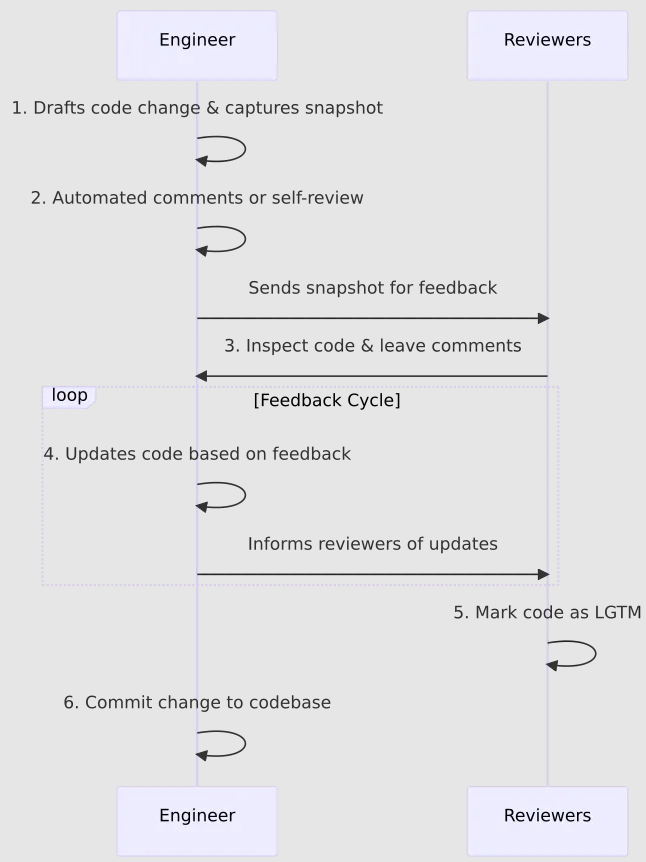
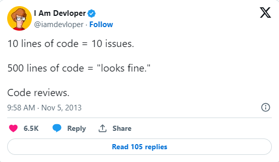
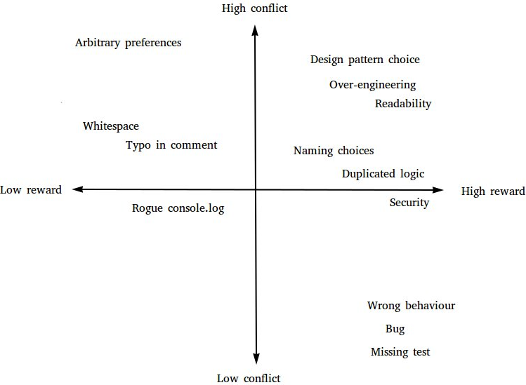

# **Quality Assurance Handbook**

# **Introduction**

# **Task Estimation in Scrum**

# **Code Reviews**

## What Are Code Reviews?
 
 - A code review is the task of someone who is not the author reviewing a piece of code before it is merged to the main codebase 
 - A code review is an essential practice to ensure that the code is high quality, aligns with predetermined standards, contains no mistakes
 - Many companies practice different processes of how to carry out code reviews. Different processes depend on a number of factors such as, the level of experience of developers, specific project or regulatory requirements,and the complexity and lifecycle stage of the project, etc. Below are some different approaches:
    - Checklist-Based Reviews - where reviewers follow a predetermined list of checks to follow while reviewing code.
    - Pair Programming - where a developer codes and gets real-time feedback (code review) on their code.
    - Pre-Commit Reviews - This is where code is reviewed before it is merged into the main branch.
- Google mandates code reviews and and follows the Pre-commit review. Below is a diagram of their Code Review Flow.

## Best Practices for Conducting Effective Code Reviews

- Although there are many different approaches to conducting a code review, there are some key practices that should be considered for the code review to be effective. 
- As well as key practices, included in this section are some practices that we feel are beneficial to fostering a positive and effective feedback 

- For Reviewers
    - The reviewer should be experienced enough, so that they know what they are looking for such as design, logic, and bugs
    - Adhere to a predefined checklist that define the goals and standards of the review process
    - Code reviews should not be rushed to avoid code smells entering the main codebase. Limiting code review sessions or setting a maximum line of code (LOC) per hour can ensure that the reviewer does not lose focus
    - Feedback should be constructive. Providing constructive feedback helps to enhance understanding and learning rather then incite competition or conflict.
- For Reviewees
    - Reviewee must be receptive to feedback. They must have a willingness to learn and understand criticism is not personal.
    - Code must be reviewed by the reviewee before requesting a code review, to save the reviewers from having to respond to miscellaneous errors such as spelling mistakes.
    - Seek and give clarity when needed. Be prepared to offer clarity on code you have produced and seek clarity when feedback is unclear.
    - Small, incremental code changes should be the aim as code with many lines is more straneous to review. 

    

## The Psychological Aspects of Code Reviews

- Understanding the psychological aspects of code reviews are vital to ensure effective code reviews because they impact team collaboration dynamics and team members personal growth. Code review procedures can be improved and made more productive by comprehending and taking care of these factors. 

- Ownership: The 'endowment effect' shows that people value their work more highly simply because it's theirs, making objective self-review and acceptance of criticism challenging.
- Worthwhileness vs Conflict Potential: When conducting a code review, certain review comments will carry more risk of potential conflict and may not be worthwhile commenting while some comments are certainly worthwhile. To explain, below is a grid that places certain comments along two axes: worthwhileness and conflict potential. 

    

- There are approaches both reviewers and reviewees can take to avoid conflict and encourage collaboration
    - Reviewers
        - Use collaborative language and avoid using the word "You". For example, a better way of saying "Your code is inefficient" would be "How could we optimize this for better performance".
        - Avoid leaving many comments where possible as this can demotivate the reviewer, instead prioritise essential comments, which brings the code up to a level of acceptance.
        - As well as leaving constructive feedback, always attempt to leave a positive comment on something you felt was done well. This can boost the confidence of the reviewee.
    - Reviewee
        - Seems simple but ensure you reply to comments left by a reviewer as well as thanking them for taking the time to review your code.
        - Ensure to annotate your pull request to give context to your changes to the reviewer.

## Advantages and Disadvantages of Code Reviews

# **Defect Management**
