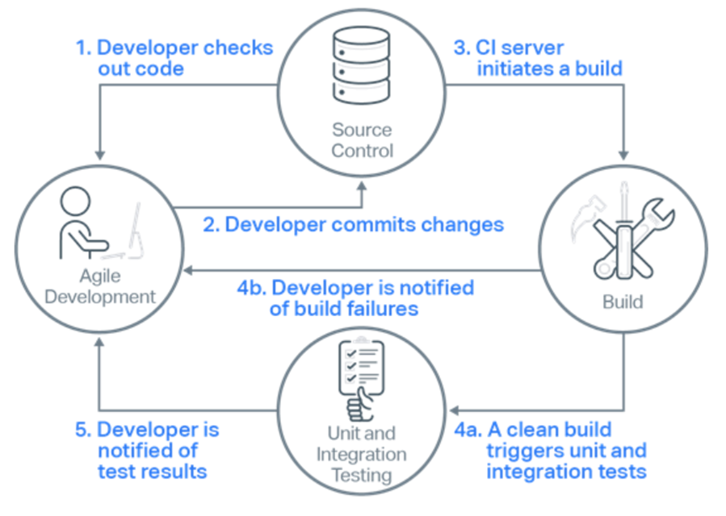
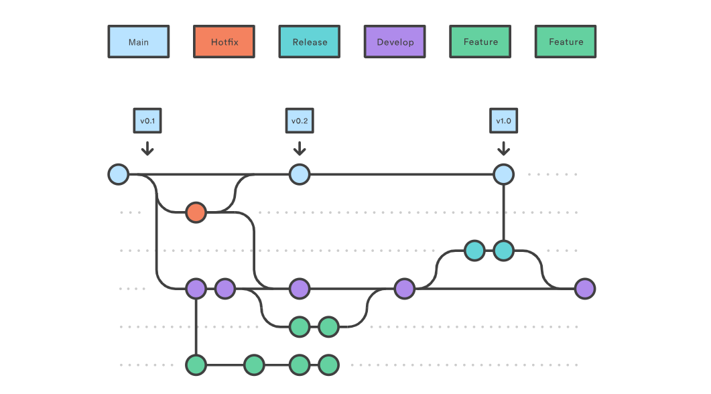
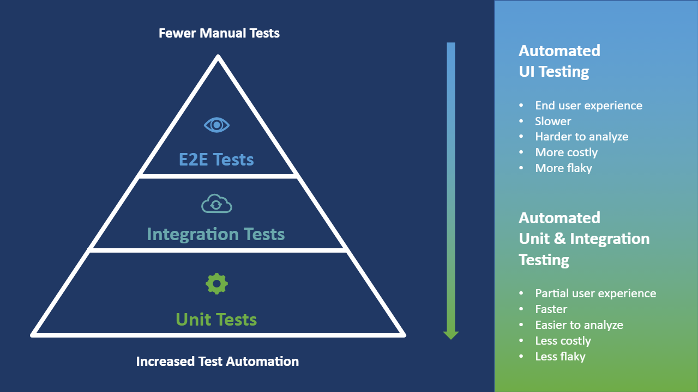
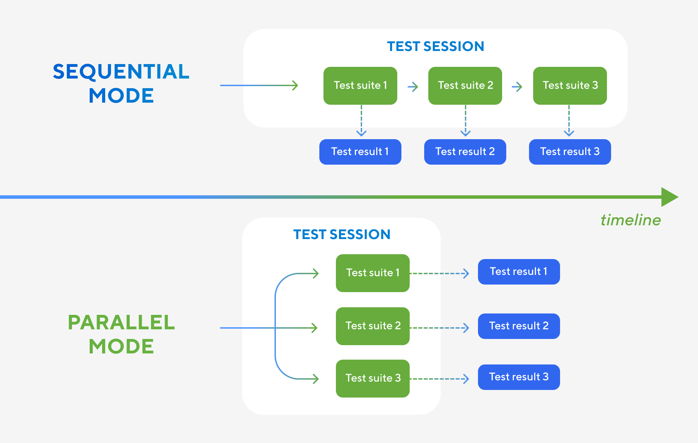
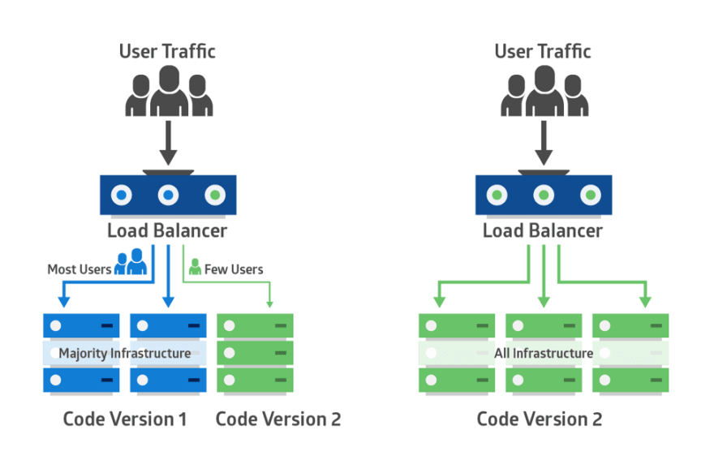
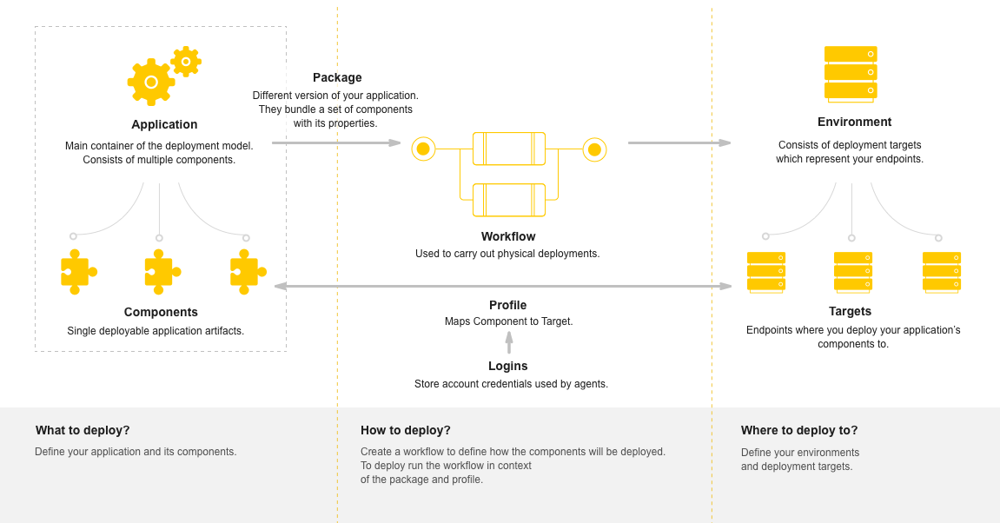
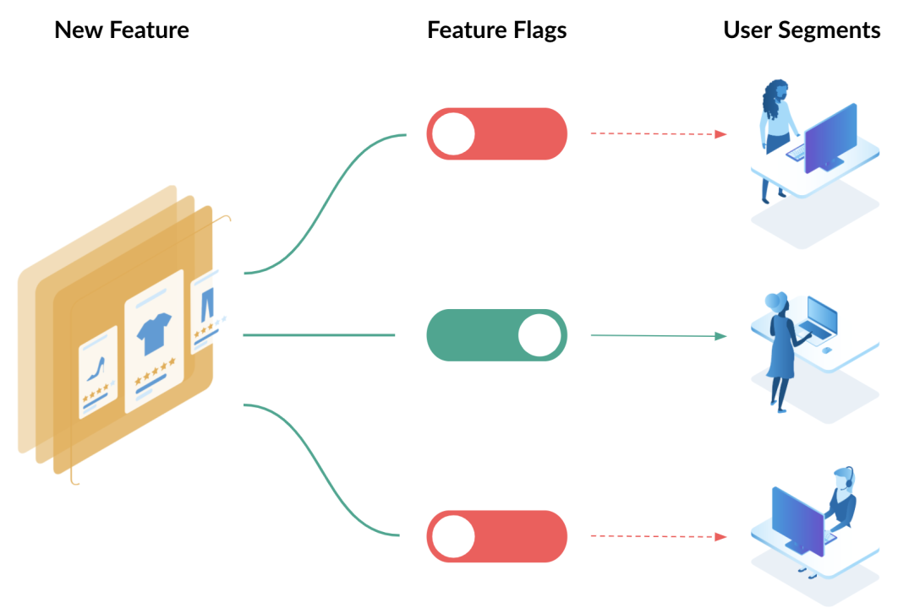
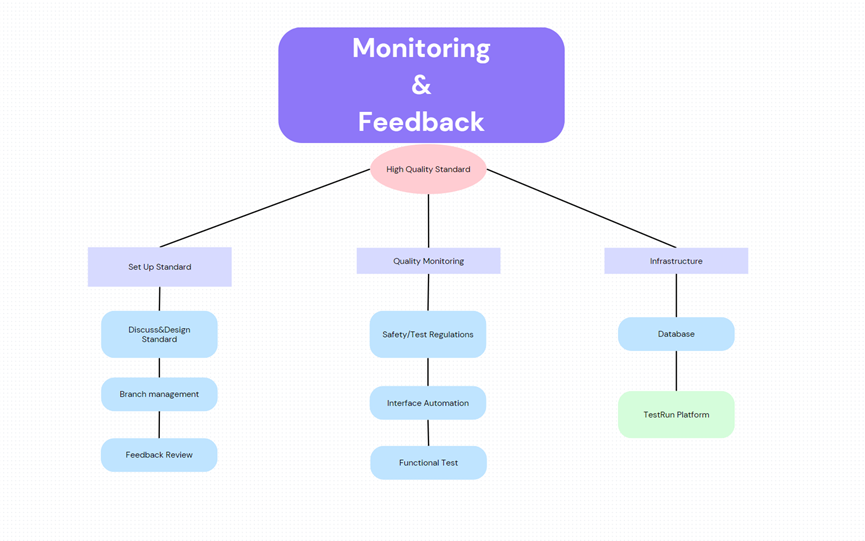

# Quality Assurance Handbook

## Introduction
**Welcome to our company software quality assurance handbook.**

The purpose of the following document is to define and encourage guidelines and best practices for the topics outlined below to enhance software quality, team collaboration, and understanding.

Each topic is divided into small digestible sections to facilitate ease of reading. Further information about each topic can be found in the references section at the bottom of the document. Each section also contains a link to the relevant reference subsection. 

### Document Structure
- [Task estimation in scrum](#task-estimation-in-scrum) 
	- [Introduction to task estimation](#introduction-1)
	- [Estimation Techniques](#estimation-techniques)
	- [Challenges and Considerations for task estimation](#challenges-and-considerations-for-task-estimation)
	- [Regular Estimation Reviews and Adjustments](#regular-estimation-reviews-and-adjustments)
	- [Team Velocity and Calculating Estimations](#team-velocity-and-calculating-estimations)
- [Code Reviews](#code-reviews)
	- [What are code reviews](#what-are-code-reviews)
	- [Best practices for conducting effective code reviews](#best-practices-for-conducting-effective-code-reviews)
	- [The psychological aspect of code reviews](#the-psychological-aspects-of-code-reviews)
	- [Advantages and disadvantages of code reviews](#advantages-and-disadvantages-of-code-reviews)
	- [Code reviews in CI/CD](#code-reviews-in-cicd)
- [Continuous Integration & Deployment](#continuous-integration--deployment) 
	- [Introduction to CI/CD](#introduction-2)
	- [Continuous integration workflow](#continuous-integration-workflow)
	- [Automated Testing](#automated-testing) 
	- [Deployment process](#deployment-process)
	- [Monitoring and feedback loops](#monitoring-and-feedback-loops)
	- [Security practices](#security-practices) 

## Task Estimation in Scrum
  
### Introduction  
- Task estimation is the process a scrum team goes through outlining how long a given task or user story will take to complete. 
    - Teams usually measure using units like story points which represent the estimated effort required to complete the task. 

    - There are also various methods for calculating these units, like planning poker and t-shirt sizing, etc, which we will discuss [below.](#estimation-techniques) 
    
    - These methods take all team members' opinions into account to facilitate a more accurate estimation process. 

    - The primary goal of task estimation is to improve the accuracy of sprint planning and facilitate sustainable/predictable project progress.

    - In the below sections, we will outline guidelines and best practices related to the topic of task estimation in scrum while also highlighting what should be avoided in relevant sections.

### Estimation Techniques

- There are many different approaches and techniques to estimating tasks, such as:

	 - Planning Poker: Team members anonymously estimate the effort of a task by playing a number card that represents story points face down. Once everyone has given their estimates, all cards are revealed. The team then shares and discusses the rationale behind their decisions. This discussion leads to a collective agreement on the final estimate of the task.
	 - T-Shirt Sizes: Uses sizes (XS, S, M, L, XL) to estimate the size complexity of tasks.
	 - Fibonacci Story Points: Used to represent the effort required for completing a task using the Fibonacci number sequence 1,2,3,5,8,13.

- Despite the variety of techniques available, there are foundational best practices that all teams should adhere to, regardless of the specific estimation method employed.

	- Estimates should be made by the people carrying out the work not an above hierarchy.
	- Acknowledge human tendencies like optimism bias that can lead to underestimation.
	- Avoid using time-based estimates, as time is a definite measurement, and a definite measurement does not fit into the agile methodology. 
	- Continually refine and adjust estimates as the team velocity becomes more apparent.

### Challenges and Considerations for Task Estimation

- Although task estimation presents its challenges, it can be simplified and made more effective through deliberate considerations.

	- Challenges

		- Optimism and Individual Bias: Estimators may experience optimism or personal bias which can hinder accurate estimation.
		- Understanding Task Complexity: Misunderstanding the task or not knowing the full breadth of the task can lead to inaccurate task estimations.
		- Stakeholder / External pressure: Project constraints such as deadlines and budgets can influence the estimation process. Deadline pressures may lead to tasks being optimistically estimated and ultimately being inaccurately estimated.
		- Parkinson's Law / Changing requirements: Parkinson's Law is the observation of work expanding (new requirements) to fill the time available for its completion. This can lead to inaccurate task estimations as the original estimation did not consider the new requirements.

	- Considerations 

		- Use Previous Estimations: Utilise previous task estimations and the actual effort exerted on the task to provide a more accurate estimate, learning from previous experiences.
		- Experienced Developers: Use the experience and expertise of senior developers to best explain the task on hand and the technical requirements to complete the task.
		- Risk Management: Attempt to identify potential risks or unforeseen challenges that may be involved in a particular task. potentially add some buffer estimates to consider these risks.

### Regular Estimation Reviews and Adjustments

#### Sprint Retrospective
- Time should be allocated in the sprint retrospective to address estimations; this allows the team to identify common trends of over and under-estimation.
- All team members should be included in these discussions, as each member can enrich the discussion and offer unique insights into how to more efficiently estimate a given task.

 

#### Team Culture
- A culture of learning and continuous improvement should be installed in the scrum team.
- Discussion should be open; people should feel safe to explain why they misestimated their tasks, and others should be willing to provide feedback to them on how to improve. Individuals should embrace feedback to be more accurate in the future.
- The team should follow the principles below for estimation.

 
 
#### Quantify and Track
- Variance between estimates and actual task time should be measured and quantified so that overestimation or underestimation outside of a given threshold can be identified and discussed in meetings. Useful tools for this would be burndown charts or velocity tracking.
- It is important for the team to document planning processes, previous estimates and actual task time to inform new employees and future task estimation.
 
#### Dynamic estimation
- Tasks should be regularly monitored during the sprint and if progress varies significantly from estimates, this should be flagged, identified why and then taken into consideration for planning similar tasks in the future.
- Task estimation is not an exact science, and estimates should be adjusted dynamically during the sprint as new information becomes available to ensure the team is informed and deadlines can be adjusted accordingly.
- The team should experiment with different planning techniques as mentioned previously until they find one that produces the most accuracy for their team.

#### Our Task estimation process

### Team Velocity and Calculating Estimations 

#### What is team velocity
- Velocity, put simply, is the amount of work a team is capable of in a single sprint. This metric should be used as a tool for estimating/planning and not for performance.

 
#### Calculating Velocity
- Historical data should be used to inform the team velocity based on story points or hours completed. This ensures that estimates are more informed and accurate.
- A consistent measurement process should be used to ensure all historical data is accurate, or if measurement metrics are changed this should be taken into account when viewing historical data.
- Teams should constantly review their team velocity, taking into account both historical and any new data added since the previous calculation.
- Velocity is not an exact science and variability should be accounted for in planning.
   
#### Avoidances
- Teams should avoid prioritising quantity of work over quality. Quality should not be compromised in order to close a task on time.
- Teams should not neglect the quality assurance process, ample time should be given to ensure testing and code reviews can take place.
- Inflating the velocity of a team beyond its capabilities to meet expectations should be avoided as this will increase the stress of the team and promote poor quality.

## Code Reviews

### What Are Code Reviews?
 
 - A code review is the process of getting feedback and approval from other developers on submitted code before it is merged into the main codebase. 
 - A code review is an essential practice for ensuring that the code meets predetermined standards, is of high quality, and is free from bugs.
 - Many companies practice different processes of how to carry out code reviews. Different processes depend on a number of factors such as, the level of experience of developers, specific project or regulatory requirements,and the complexity and lifecycle stage of the project, etc. Below are some different approaches:
    - Checklist-Based Reviews - where reviewers follow a predetermined list of checks to follow while reviewing code.
    - Pair Programming - involves two developers, where a developer codes and gets real-time feedback off another developer (code review) on their code.
    - Pre-Commit Reviews - This is where code is reviewed before it is merged into the main branch.
- Google mandates code reviews and follows the Pre-commit review. Below is a diagram of their Code Review Flow.

 

### Best Practices for Conducting Effective Code Reviews

- This section highlights key practices for both reviewers and reviewees that we believe are beneficial in fostering a positive and productive feedback environment.

- For Reviewers
    - The reviewer should possess enough experience to effectively identify key aspects such as design, logic, and bugs.
    - Adhere to a predefined checklist that define the goals and standards of the review process.
    - Code reviews should not be rushed to avoid code smells entering the main codebase. Limiting code review sessions or setting a maximum line of code (LOC) per hour can ensure that the reviewer does not lose focus.
    - Feedback should be constructive. Providing constructive feedback helps to enhance understanding and learning rather then incite competition or conflict.
- For Reviewees
    - Reviewee must be receptive to feedback. They must have a willingness to learn and understand criticism is not personal.
    - Code must be reviewed and tested by the reviewee before requesting a code review.This saves the reviewers from having to respond to miscellaneous errors such as spelling mistakes.
    - Seek and give clarity when needed. Be prepared to offer clarity on code you have produced and seek clarity when feedback is unclear.
    - Small, incremental code changes should be the aim as code with many lines is more strenuous to review. 

### The Psychological Aspects of Code Reviews

- Understanding the psychological aspects of code reviews are vital to ensure effective code reviews because they impact team collaboration dynamics and team members personal growth. Code review procedures can be improved and made more productive by comprehending and taking care of these factors. 

- Ownership: The 'endowment effect' shows that people value their work more highly simply because it's theirs, making objective self-review and acceptance of criticism challenging.
- Worthwhileness vs Conflict Potential: When conducting a code review, certain review comments will carry more risk of potential conflict and may not be worthwhile commenting while some comments are certainly worthwhile. To explain, below is a grid that places certain comments along two axes: worthwhileness and conflict potential. 

- Below are approaches both reviewers and reviewees can take to avoid conflict and encourage collaboration.
    - Reviewers
        - Use collaborative language and avoid using the word "You". For example, a better way of saying "Your code is inefficient" would be "How could we optimize this for better performance".
        - Avoid leaving many comments where possible as this can demotivate the reviewer, instead prioritise essential comments, which brings the code up to a level of acceptance.
        - As well as leaving constructive feedback, always attempt to leave a positive comment on something you felt was done well. This can boost the confidence of the reviewee.
    - Reviewee
        - Ensure you reply to comments left by a reviewer as well as thanking them for taking the time to review your code.
        - Ensure to annotate your pull request to give context to your changes to the reviewer.

### Advantages and Disadvantages of Code Reviews

- **Advantages of code reviews**
    - **Enhanced code quality:** Independent reviewers can identify spelling mistakes, formatting issues, potential bugs, errors in logic, or security vulnerabilities that automated testing may miss, therefore enhancing the code quality and reducing the risk of bugs.
    - **Mentorship:** Code reviews allow developers to gain insights into their own code from feedback from developers with varying experiences, allowing the developer to improve their coding ability.
    - **Knowledge Sharing:** Reviewers can also learn best practices from reviewing other developers' code while also gaining a better knowledge of the code base as they may be asked to review a section of code they have never looked at before.

- **Disadvantages of code reviews**
    - **Time-consuming:** Code reviews can be time-consuming, taking time away from developing features, which can delay releases, especially in teams with limited developer capacity.
        - Mitigation: Ensure the team spreads the work of code reviews, avoiding over-reliance on certain developers.
    - **Conflict potential:** The potential for conflict to arise among developers if opinions differ and communication is not polite/collaborative.
        - Mitigation: Ensure all team members communicate in a collaborative and professional manner.
    - **Demoralizing:** Similarly, if feedback is not presented in a rude or non-constructive manner, the developer may feel demoralized and unmotivated.
        - Mitigation: Ensure feedback is given in a constructive and respective manner. 
    - **Oversights:** There is always a risk that some bugs, bad practices, etc, may be overlooked by reviewers, especially if a review is long, and fatigue may play a factor.
        - Mitigation: Encourage smaller incremental changes to reduce the size of code reviews, set a time limit for looking at a code review in one sitting and introduce automation tools to identify issues early and reduce the number in reviews.

### Code reviews in CI/CD
- Code reviews play an important role in the continuous integration and deployment process which is outlined [below](#continuous-integration--deployment).
- Code reviews occur when a pull request is created to merge a branch into the develop branch after passing the automated tests.
- Code reviews can also be automated using static analysis tools, linters, and automated security vulnerability scanners. These tools can automatically flag potential issues before a human reviewer looks at the code.

## Continuous Integration & Deployment

### Introduction
- CI/Cd is a DevOps practice which stands for Continuous Integration and Deployment. 

- **Continuous Integration** is the practice of committing code to a repository very frequently, these repositories have automated workflows to build and test the committed code. If either process fails, the team is informed, and merging is stalled until the issue has been resolved. This practice identifies issues in the code early, therefore reducing code incompatibility and merge conflicts.

- **Continuous Deployment** is the practice of frequently deploying code to production through automated pipelines. There are many deployment strategies, such as blue/green, canary, shadow, etc. We recommend Canary, as outlined, and justified [below.](#canary-strategy)

### Continuous Integration Workflow

#### Gitflow compliance
-	All developers must follow our company Gitflow branching strategy outlined in the diagram below and the following [link](https://www.atlassian.com/git/tutorials/comparing-workflows/gitflow-workflow).

#### Committing practices
-	Developers are encouraged to commit changes to their branches often (commit once one logical unit of work is completed)
#### CI platform integration
-	These commits should trigger an automated build and test process utilising a CI platform like Jenkins, Travis CI or GitHub actions.
#### Containerization Strategy
-	Automation should utilise containerisation solutions like docker to ensure a uniform build and testing environment that replicates the production environment. This avoids the famous “it works on my machine” issue.
#### Automated Testing Guidelines
-	Guidelines for creating these automated tests are in the section [below](#automated-testing)
#### Failure Response Protocol
-	If a build or test fails, the team should be notified so that the issue can be addressed immediately, no new code should be added until the issue is resolved.
#### Local and Manual Testing
-	Developers should not neglect testing locally, as over-reliance on automated testing may slow down our pipeline.
-	Developers should also not neglect manual testing; it is still important to perform Exploratory tests, User experience tests, etc, to test unique scenarios automation may not cover. 

### Automated Testing 

#### Test Pyramid strategy 

- The process where quick and simple tests are run first, followed by more complex tests that take longer to run. 
- We would first run unit tests, which are lightweight and ensure code work by addressing the smallest possible unit of behaviour. 
- Next Integration tests are used to test that different pieces of software interact with each other as expected.
- Next End to end test, which runs through the entire system are run. It is recommended to limit the number of these as they can take a long time and be flaky.
- Finally, performance testing is used to assess how a system will perform in a production-like environment using Load and Stress tests.

#### Test Coverage
- Although not an exact science a minimum of 80% coverage is recommended.
- It is crucial to develop quality tests as line coverage does not translate to quality tests.
	
#### Regular Test updates
- Tests should be regularly reviewed to ensure that they are of high quality and cover new features as they are added.

#### Flaky Test Management
- These are tests that both pass and fail without changes to the test or code, which slows down the CI/CD pipeline.
- Addressing the issue: Label as flaky so these tests run separately until fixed, identify poor data management, and check test environment management.
- Avoid using delays or sleep methods.

#### Parallel Test Execution 
- The test suite should be segmented and run in parallel. 
- This facilitates quicker feedback, better usage of our resources, and increased test coverage as we can now run more tests.

### Deployment Process 

#### Canary Strategy
- Developers should follow a Canary Deployment Strategy to ensure fast deployment and feedback while minimizing the risk of defects affecting users. This is ideal for our fast-moving team, to ensure we are developing quickly while also reducing the current issue of high defects making it to production.
	- A new version of the application should be rolled out to a select group of users 
	- Data and feedback are gathered from the users and is incorporated into the new version before deploying to the entire user base
	- If an issue is identified we can roll back the application to the previous state and address the issues, which will only affect the canary users
	- We incrementally roll out the update to more users until all users are on the updated version, continuing to incorporate feedback and monitor the application 
    

#### Automatic Deployment Process
- Deployment similar to integration should be automated using CI/CD tools like Jenkins 
- Infrastructure as code should be used to ensure a consistent environment, tools like Terraform and Ansible should be utilised 

#### Feature Toggle
- Developers should implement feature toggle (or flags) to enable the toggling on and off of features without the need to redeploy code
- This is useful with canary as it allows us to make dynamic changes to our application without downtime.

#### Roll back Strategy
- The rollback strategy should be automatically triggered if the deployment fails, there is a significant increase in error rates, security vulnerabilities are detected or if user feedback is negative. 
- If the issue is feature-specific, we can toggle the feature off and either remove it or improve based on feedback. If the issue is more widespread we roll back to previous stable version. 

### Monitoring and feedback loops

* View: During the project building process, keep update and send feedback to different parts is important. 
* Adjustment: Feedback received by different departments to make changes. 
* Improvement: Under the agile monitoring and feedback system, fast feedback, fast verification, and fast delivery are inevitable
	- Good reviews and feedback are important to help steer the developer in the right direction.

### Security Practices 
- Security testing and scanning should be automated and run regularly throughout the entire CI/CD pipeline to scan for vulnerabilities and non compliance with our security regulations. This involves scanning code, dependencies and our infrastructure as code configurations for vulnerabilities.
 
- Below is a diagram of all the stages we cna implement security testing in our pipeline:
 

 
- Tools for automating and identifying security vulnerabilities include static apllication security testing (SAST), dynamic application security testing (DAST) and software composition analysis (SCA).
 
- The CI/CD pipeline should implement role based access control, to ensure that only users that have been granted access may intiate builds, access sensitive data or deploy code.
 
- The topics talked about in previous sections are also key in enhancing security as the [Canary release strategy](#canary-strategy), [Feature togle](#feature-toggle), [automated testing](#automated-testing) and [Code Reviews](#code-reviews)

